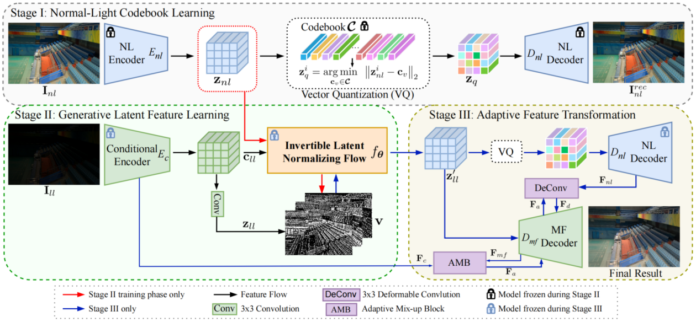

#  [ECCV 2024] GLARE: Low Light Image Enhancement via Generative Latent Feature based Codebook Retrieval [[Paper]](https://arxiv.org/pdf/2407.12431)

<h4 align="center">Han Zhou1,*, Wei Dong1,*, Xiaohong Liu2,&dagger, Shuaicheng Liu3

<h4 align="center">1.Sichuan University, 2.Southwest Jiaotong University, 
<h4 align="center">3.University of Electronic Science and Technology of China,

<h4 align="center">4.Shanghai Jiaotong University, 5.Megvii Technology

### Introduction
This repository represents the official implementation of the paper titled **GLARE: Low Light Image Enhancement via Generative Latent Feature based Codebook Retrieval**. If you find this repo useful, please give it a star ⭐ and consider citing our paper in your research. Thank you.

We present GLARE, a novel network for low-light image enhancement.

- **Codebook-based LLIE**: exploit normal-light (NL) images to extract NL codebook prior as the guidance.
- **Generative Feature Learning**: develop an invertible latent normalizing flow strategy for feature alignment.
- **Adaptive Feature Transformation**: adaptively introduces input information into the decoding process and allows flexible adjustments for users. 
- **Future:** network structure can be meticulously optimized to improve efficiency and performance in the future.

### Overall Framework

